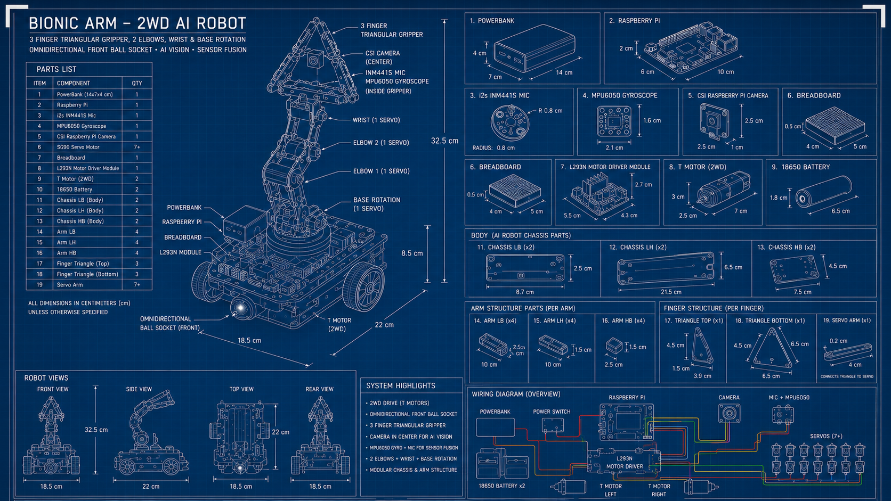

<div align="center">
  <h1>🦁 Project MXSA — Simba Robot</h1>
  <pre>
███████╗██╗███╗   ███╗██████╗  █████╗       ███╗   ███╗██╗  ██╗███████╗ █████╗
██╔════╝██║████╗ ████║██╔══██╗██╔══██╗      ████╗ ████║╚██╗██╔╝██╔════╝██╔══██╗
███████╗██║██╔████╔██║██████╔╝███████║█████╗██╔████╔██║ ╚███╔╝ ███████╗███████║
╚════██║██║██║╚██╔╝██║██╔══██╗██╔══██║╚════╝██║╚██╔╝██║ ██╔██╗ ╚════██║██╔══██║
███████║██║██║ ╚═╝ ██║██████╔╝██║  ██║      ██║ ╚═╝ ██║██╔╝ ██╗███████║██║  ██║
╚══════╝╚═╝╚═╝     ╚═╝╚═════╝ ╚═╝  ╚═╝      ╚═╝     ╚═╝╚═╝  ╚═╝╚══════╝╚═╝  ╚═╝
  </pre>
  <p><b>Autonomous Edge AI Bionic Robot</b></p>
  <br>
  
</div>

Welcome to **Project MXSA**, the official codebase for the Simba autonomous robot. 
Simba is a 2WD differential drive robot powered by a Raspberry Pi 4, utilizing edge AI (Qwen2.5-0.5B via Ollama), a 5MP CSI camera for computer vision, an MPU6050 IMU, and localized speech processing.

---

## 👁️🗨️ Vision, Voice & Motion

*   **Vision:** MobileNetV2 feature extraction + SVM classifier pipeline for edge object detection via a 5MP CSI camera, with optional YOLOv8n acceleration.
*   **Voice:** Offline local speech recognition with Vosk for conversational capability without cloud limits.
*   **Motion:** Precise 2WD differential drive logic combined with a 4-DOF robotic arm using SG90 servos and the L298N motor driver.

---

## 🌟 Key Features

*   **Autonomous Brain:** Real-time LLM inference allowing Simba to hold conversations, make decisions, and show emotions via its web dashboard.
*   **Edge Computer Vision:** Hybrid object detection (MobileNetV2 + LinearSVC) tuned to natively support the Raspberry Pi **5MP CSI Camera (OV5647)** at `2592x1944` resolution with hardware ISP acceleration.
*   **Custom Training Studio:** A dark glassmorphism web UI that lets you train custom vision and voice profiles dynamically using your own camera.
*   **Hardware Command Center:** Bypass the AI and directly control the robot's hardware (Chassis, Arm, Hand) via a stunning web-based remote control dashboard with WASD controls, active motor braking, and precise servo sliders.

---

## ⚙️ Hardware Requirements

*   **Raspberry Pi 4 Model B** (4GB+ RAM recommended)
*   **5MP CSI Camera Module V1 (OV5647)**
    *   *Note: Ensure your Pi's GPU memory is allocated to at least `128MB` (`sudo raspi-config` -> Performance Options) to support 5MP streaming.*
*   **Motor Driver:** L298N (6-pin setup with ENA/ENB for 2WD chassis).
*   **Servos:** 4 for the Arm (Rotation, Elbow 1, Elbow 2, Wrist), 3 for the Hand/Gripper (7 total).
*   **IMU:** MPU6050 (I2C).
*   **Audio:** INMP441 I2S MEMS Microphone + USB/I2S Speaker.

*For precise wiring connections, see the [Hardware Connections Guide](hardware/connections.md).*

---

## 🚀 Installation & Setup

1.  **Clone the Repository:**
    ```bash
    git clone https://github.com/MXSA-P/MXSA.git
    cd MXSA
    ```

2.  **Run the Installer Script:**
    This script automatically installs all apt dependencies, creates the Python virtual environment, configures I2C/I2S, and verifies your GPU memory for the 5MP camera.
    ```bash
    sudo bash scripts/install_pi.sh
    ```

---

## 🖥️ Usage Commands

Simba is split into two primary modes: the operational **Brain** and the **Trainer**. Both web interfaces are protected with HTTP Basic Authentication.

### 🔑 Web Interface Credentials
| Interface | URL | Default Username | Default Password | Environment Overrides |
| :--- | :--- | :---: | :---: | :--- |
| **Simba Brain Dashboard** | `http://<PI_IP>:8080/` | `mxsa` | `mx` | `SIMBA_WEB_USER` / `SIMBA_WEB_PASS` |
| **AI Profile Trainer** | `http://localhost:5000/` | `mxsa` | `mx` | `TRAINER_USER` / `TRAINER_PASS` |

> **Security Note:** For deployment on open or shared networks, always override default passwords using the respective environment variables before launching the services.

### 1. The Brain (Main Dashboard & Hardware Control)
To boot Simba into operational mode (where the AI is active):
```bash
./scripts/start_simba.sh
```
*   **Dashboard:** Open a browser on any device in the same network and navigate to `http://<PI_IP>:8080/`. Here you can view Simba's thoughts, emotions, and telemetry.
*   **Hardware Command Center:** Navigate to `http://<PI_IP>:8080/hardware` for the manual remote control interface (live camera feed, D-Pad, servo sliders, and active braking).

### 🔧 Troubleshooting Hardware
- **`failed to initialise picamera2: list index out of range`**: This means your camera isn't enabled. Run `sudo raspi-config`, navigate to Interfacing Options, and enable the Legacy Camera / Libcamera interface. Ensure the ribbon cable is seated correctly.
- **`failed to start audio stream: Error querying device -1`**: No default microphone is set in your OS. The system will gracefully fallback to `device 0`, but you can set a default by configuring PulseAudio/ALSA.

### 2. The Trainer (AI Profile Management)
To install and boot the trainer interface on your Windows PC:
* **Install:** Double-click `install_trainer.bat` (or run `scripts\install_trainer.bat`) to install dependencies.
* **Start:** Double-click `start_trainer.bat` (or run `scripts\start_trainer.bat`) to launch the Trainer dashboard.
*   **Trainer UI:** Navigate to `http://localhost:5000/` to use your computer's webcam to capture training data and deploy the updated AI models directly to the Pi. (Note: The trainer runs on your development PC, not the Pi.)
*   **Image Management:** The Trainer includes a robust REST API (`GET /api/objects/<name>/images` and `DELETE /api/objects/<name>/<filename>`) and a visual gallery interface allowing you to easily view, manage, and delete individual training snapshots directly from the browser.

---

## 🛡️ Fortification Details
*   **Memory Management:** The machine learning algorithms forcefully collect garbage (`gc.collect()`) after matrix operations to prevent OOM errors.
*   **Log Rotation:** `simba_system.jsonl` is hard-capped at 5MB with 3 backups, ensuring infinite runtime without filling your SD card.
*   **Hardware Fallbacks:** If a limb or sensor is disconnected, `brain.py` dynamically falls back to mock drivers to keep the rest of the system running smoothly.

---

_max_cyan_ — project_mxsa
